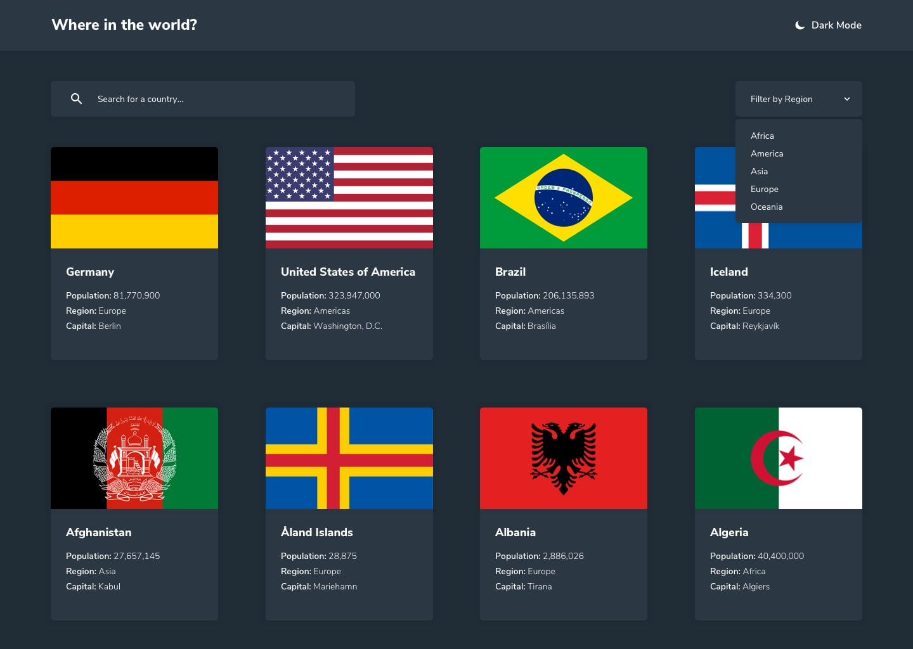

# Frontend Mentor - REST Countries API

## Table of contents

- [Overview](#overview)
  - [The challenge](#the-challenge)
  - [Screenshot](#screenshot)
  - [Links](#links)
  - [Built with](#built-with)
  - [Useful resources](#useful-resources)
- [Author](#author)

## Overview

This is a solution to the [REST Countries API challenge on Frontend Mentor](https://www.frontendmentor.io/challenges/rest-countries-api-with-color-theme-switcher-5cacc469fec04111f7b848ca). Frontend Mentor challenges help you improve your coding skills by building realistic projects. 

### The challenge

Users should be able to:

- See all countries from the API on the homepage
- Search for a country using an `input` field
- Filter countries by region
- Click on a country to see more detailed information on a separate page
- Click through to the border countries on the detail page

### Screenshot

<!-- <!-- ### Links -->

- Solution URL: [solution URL](https://github.com/joey493/Frontend-Mentor-REST-Countries-API)
- Live Site URL: [live site URL](https://tender-visvesvaraya-3673ed.netlify.app/)

### Built with

- HTML
- CSS
  - Flexbox
  - CSS Grid
  - custom properties
- JAVASCRIPT
  - React
    - React icons
    - React Router

### Useful resources

- [React](https://reactjs.org/) - JS library
- [restcountries](https://restcountries.com/#api-endpoints-v2) - REST API

## Author

<!-- - Website - [Add your name here](https://www.your-site.com) -->
- Frontend Mentor - [@yourusername](https://www.frontendmentor.io/profile/yourusername)
- LinkedIn - [Ibrahim](https://www.linkedin.com/in/ibrahim-nader-3a65351b6/)
- Twitter - [@ibrahim33996](https://twitter.com/ibrahim33996)
